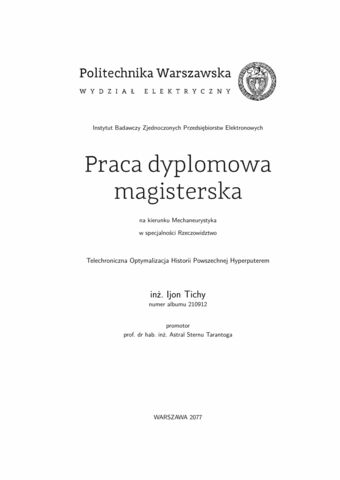

*[POLSKI](README.md)*

## About template

The thesis template for Faculty of Electrical Engineering at WUT conforming to Directives of WUT Rector: 57/2016, 42/2020, 109/2021, 3/2022 and 4/2022.

All "must have" regulations are fulfilled.

Most options are set according to guidance rules described in Directives. All differences are within acceptable restrictions of the style modifications. Changes introduced for thesis clarity:

  * increased interline light (line-skip)
  * emphasized chapter headers
  * accented with color and clickable references

Template is only for single-author theses, according to applicable editorial requirements.

## Using template in Overleaf

  * Thanks to [Overleaf](https://www.overleaf.com/), where one can setup a free-of-charge account, it is possible to edit thesis in a browser.
  * There is no need to install anything to make use of LaTeX.
  * Thesis content can be edited at the same time more than one person. It provides possibility to workgroup between Supervisor and Student.
  * It is easy to download resulting PDF file and ZIP package with current thesis.
  * Stable version of this template is distributed in Overleaf as [template](https://www.overleaf.com/latex/templates/ee-dyplom/qtrkhzdfcfvv).
  * Template version in Overleaf might be outdated to the GitHub version due to delay in updating templates in Overleaf that employs manual verification of template. Therefore Overleaf version might be not fully conformant with current editorial requirements.
  * The newest published version and development version of the template are on [GitHub](https://github.com/SP5LMA/EE-dyplom).
  * Template from GitHub can be downloaded and manually uploaded to private project in Overleaf.

## Using template - first steps

1. Template is prepared for XeLaTeX so if you are using Overleaf then open "Menu" and modify "Compiler" to "XeLaTeX" because the default one is different. Compilation with pdfLaTeX was tested and is possible but not recommended. For "manual" compilation of bibliography the biber application should be used.
2. Open file **EE-dyplom.tex** and setup proper type of your thesis in line **documentclass** by modifying value of **thesis** variable choosing of of: **inz**, **mgr**, **bsc**, **msc**
3. Personalize other fields in thee file **EE-dyplom.tex**
4. Modify, change and generate content in the directory **tekst**
5. Add pictures (figures) in the directory **rysunki** (gfx rather should not be used)

## Reporting issues

Thank you in advance for reporting observed problems and errors. You can use GitHub issues system or mail me: <lukasz.makowski.ee@pw.edu.pl>.

While reporting a problem please provide:

1. Problem description
2. Used operating system
3. Software used to edit files (eg.: Kile, Vim)
4. Used LaTeX compiler (eg.: XeLaTeX, pdfLaTeX)
5. Other, important aspects of configuration (eg.: codepage)

## Acknowledgments

Hereby I would like to thank other Authors whose templates were my inspiration:

  * prof. dr hab. inż. *Jacek Starzyński*, Faculty of Electrical Engineering, WUT
  * *Artur M. Brodzki* i *Piotr Woźniak*, Faculty of Electronics and Information Technology, WUT

## License and copyright

  * Template licensed with: CC-BY 4.0
  * [Human-readable summary of the Attribution 4.0 International (CC BY 4.0) License](https://creativecommons.org/licenses/by/4.0/)
  * Author: *Łukasz Makowski* <lukasz.makowski.ee@pw.edu.pl>
  * [https://github.com/SP5LMA/EE-dyplom](https://github.com/SP5LMA/EE-dyplom)

---------------------------------------------

